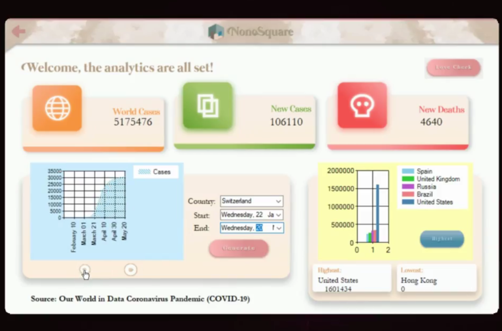

# NonoSquare

NonoSquare is a data mining application developed with the aim of supplying information. 

## Features
- It stores user-input messages, shows country ranking
- Provides data visualization of COVID-19 statistics
- Statistics are obtained from data streams accessible from open-source sites

## Tech Used
- C#
- Microsoft Visual Studio